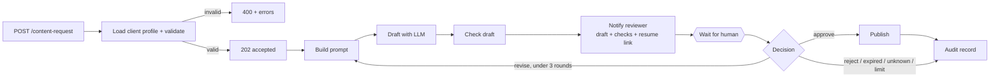

# n8n content pipeline with a human review gate

An n8n workflow that drafts a social post with an LLM, **checks the draft with deterministic code**, sends it to a human
reviewer, and only publishes after explicit approval. The reviewer can approve, ask for a revision (up to three rounds),
or reject. Every run ends in an audit record.

The point of the design: the model proposes, deterministic checks and a person decide.
Nothing is published without an approval, and an unrecognised or missing answer never counts as one.



## What it does
- **Per-client profiles.** Three fictional clients (a board-level advisor, a startup coach, a retail brand) each have their own voice,
  audience, length limit and banned words. The same pipeline serves all of them; a new client is one entry in the profile table.
- **Deterministic checks on the draft** (the model is never asked to police itself): not empty, within the length limit,
  no banned words, and **every number in the text must appear in the facts the requester supplied**. The reviewer sees the check
  results next to the draft. Failed checks do not block approval, because the human has the final say, but an approval over failed
  checks is recorded as `approved_with_failed_checks`.
- **Human-in-the-loop with a revision loop.** The reviewer replies to a one-time resume URL with `approve`, `revise` (plus feedback) or `reject`.
  A revision re-prompts the model with the feedback and the previous draft. After three rounds the run ends unpublished.
- **Safe defaults.** Invalid input is rejected before any model call. Anything other than `approve`, `revise` or `reject` (including
  a timeout after 24 hours) is treated as "no decision", never as approval.
- **Audit record** for every run: request id, client, attempts, outcome, reviewer, and the final text only if it was published.

## Files
| file | purpose |
|---|---|
| `workflow.json` | the n8n workflow (import this) |
| `build_workflow.py` | generates `workflow.json`; keeps the Code-node scripts readable |
| `mock_server.py` | offline stand-in for the LLM API, the reviewer channel, the CMS and the audit log |
| `test.py` | end-to-end test against a real n8n container |

## Run it
Needs Docker. Tested with n8n 2.42.5.

```bash
python3 test.py        # starts the mock server and n8n, imports the workflow, runs 12 checks, cleans up
```

Use it for real: import `workflow.json` in n8n (Workflows, Import from file), publish it, and set these environment variables on the n8n process:

| variable | meaning |
|---|---|
| `LLM_BASE_URL`, `LLM_API_KEY`, `LLM_MODEL` | any OpenAI-compatible chat completions API |
| `NOTIFY_URL` | where the draft and resume link are sent (Slack or Teams webhook, email gateway, ticket system) |
| `PUBLISH_URL` | where an approved post is sent (CMS, scheduler) |
| `AUDIT_URL` | where the audit record is sent (log store, sheet) |
| `N8N_BLOCK_ENV_ACCESS_IN_NODE=false` | n8n 2.x blocks `$env` in nodes by default; this workflow reads its endpoints from it. Alternatively move them into n8n credentials |

Request and review:
```bash
curl -X POST $N8N/webhook/content-request -H 'Content-Type: application/json' \
  -d '{"client":"startup-coach","topic":"Launch week lessons","facts":["We shipped in 6 weeks"]}'
# the reviewer receives a draft and a resume_url, then answers with:
curl -X POST "$RESUME_URL" -H 'Content-Type: application/json' \
  -d '{"decision":"revise","feedback":"shorter, one concrete example","reviewer":"Sam"}'
```

## Deploy it locally (to try the whole loop in a browser)
`deploy/` has a docker compose setup: n8n plus a small reviewer inbox page where you submit requests and approve, revise or reject drafts.
Both ports are bound to `127.0.0.1`; the inbox has no login, so reach it through an SSH tunnel or put authentication in front of it.

```bash
cp deploy/.env.example deploy/.env      # fill in LLM_BASE_URL, LLM_API_KEY, LLM_MODEL
deploy/deploy.sh                        # imports and publishes the workflow, starts both services
# inbox: http://127.0.0.1:8089     n8n editor: http://127.0.0.1:5678
```

## Test results
`python3 test.py`: **12/12 checks pass** against a real n8n container.
It covers invalid input (400, no model call), a full revise-then-approve round (the published text equals the approved draft,
nothing published before approval), unsupported numbers and banned words being flagged, rejection, the three-round revision limit,
and an unrecognised decision not being treated as approval.

I also ran one live request through a real model (Kimi `kimi-k2.6` via its OpenAI-compatible API): the draft passed all four checks
and the approval was published and audited. That run is not part of the repo test because it needs an API key.

## Limits (stated plainly)
- **The resume URL is a capability.** Anyone who has it can decide. Send it only over a private channel, and put authentication in front
  of the n8n webhook endpoints in production. This repo does not add an auth layer.
- **No real publishing target.** `PUBLISH_URL` is generic; the test uses a mock. Posting to a specific network (for example LinkedIn)
  must respect that platform's terms and rate limits, and this repo does not do it.
- **Checks are simple on purpose.** The number check is string matching against the supplied facts, so it cannot judge whether a claim
  is true, only whether a number was provided. Banned words are literal substrings.
- **Profiles are fictional examples** kept inside one Code node. A real deployment would load them from a database or sheet.
- The mock LLM is deterministic and tests the workflow logic, not the quality of model output.

## License
MIT, see `LICENSE`.
