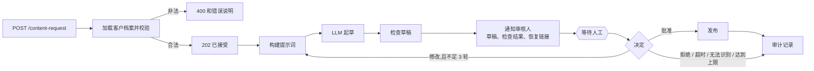

[English](README.md) | **简体中文**

# 带人工审核闸门的 n8n 内容流水线

一个 n8n 工作流:用 LLM 起草一条社交媒体文章,**用确定性代码检查草稿**,发给人工审核,只有在明确批准之后才发布。审核人可以批准、要求修改(最多三轮)或拒绝。每次运行都会留下一条审计记录。

设计的要点:模型提出,由确定性检查和人来决定。没有批准就不会发布任何东西,而无法识别或缺失的回答绝不算批准。



## 它做什么
- **按客户的档案。** 三个虚构客户(董事会级顾问、创业教练、零售品牌),各有自己的语气、受众、长度上限和禁用词。同一条流水线服务所有客户;新增一个客户就是在档案表里加一项。
- **对草稿的确定性检查**(从不让模型自己监督自己):非空、不超过长度上限、没有禁用词,并且**文中的每个数字都必须出现在请求方提供的事实里**。审核人在草稿旁边能看到检查结果。检查失败不会阻止批准,因为最终由人决定,但在检查失败的情况下批准会被记录为 `approved_with_failed_checks`。
- **带修改循环的人工审核。** 审核人向一次性的恢复链接回复 `approve`、`revise`(附意见)或 `reject`。修改会带着意见和上一版草稿重新提示模型。三轮之后,这次运行以未发布结束。
- **安全的默认值。** 非法输入在任何模型调用之前就被拒绝。除了 `approve`、`revise`、`reject` 之外的任何回复(包括 24 小时后超时),都按"没有决定"处理,绝不当成批准。
- **每次运行的审计记录:** 请求 id、客户、尝试次数、结果、审核人,只有已发布的才带最终文字。

## 文档
| 文档 | 内容 |
|---|---|
| [`docs/zh-CN/ARCHITECTURE.md`](docs/zh-CN/ARCHITECTURE.md) | 逐个节点说明、运行上下文、四项检查、决定与结果、已知缺口 |
| [`docs/zh-CN/RUNNING.md`](docs/zh-CN/RUNNING.md) | 运行测试、在自己的 n8n 里使用、本地部署审核页面、故障排查 |
| [`docs/zh-CN/TESTING.md`](docs/zh-CN/TESTING.md) | 12 项检查、mock 服务、没有测试的东西、如何新增检查 |
| [`docs/zh-CN/SECURITY.md`](docs/zh-CN/SECURITY.md) | 恢复链接、审核页面没有登录、提示词注入、密钥、隐私 |
| [`docs/zh-CN/EXTENDING.md`](docs/zh-CN/EXTENDING.md) | 新增客户、更换审核渠道和发布目标、更换模型 |

## 文件
| 文件 | 作用 |
|---|---|
| `workflow.json` | n8n 工作流(导入这个) |
| `build_workflow.py` | 生成 `workflow.json`;让 Code 节点的脚本保持可读 |
| `mock_server.py` | 离线替身,充当 LLM 接口、审核渠道、CMS 和审计日志 |
| `test.py` | 针对真实 n8n 容器的端到端测试 |
| `deploy/` | docker compose、审核页面 `inbox.py` 和 `deploy.sh`,用于本地部署 |

## 运行
需要 Docker。已用 n8n 2.42.5 测试。

```bash
python3 test.py        # 启动 mock 服务和 n8n,导入工作流,运行 12 项检查,然后清理
```

实际使用:在 n8n 里导入 `workflow.json`(Workflows,Import from file),发布它,并在 n8n 进程上设置这些环境变量:

| 变量 | 含义 |
|---|---|
| `LLM_BASE_URL`、`LLM_API_KEY`、`LLM_MODEL` | 任意 OpenAI 兼容的聊天补全接口 |
| `NOTIFY_URL` | 草稿和恢复链接发到哪里(Slack 或 Teams 的 webhook、邮件网关、工单系统) |
| `PUBLISH_URL` | 批准的文章发到哪里(CMS、排期工具) |
| `AUDIT_URL` | 审计记录发到哪里(日志存储、表格) |
| `N8N_BLOCK_ENV_ACCESS_IN_NODE=false` | n8n 2.x 默认禁止节点内使用 `$env`;本工作流从中读取各个地址。也可以改放进 n8n 凭据 |

请求和审核:
```bash
curl -X POST $N8N/webhook/content-request -H 'Content-Type: application/json' \
  -d '{"client":"startup-coach","topic":"Launch week lessons","facts":["We shipped in 6 weeks"]}'
# 审核人收到草稿和 resume_url,然后这样回复:
curl -X POST "$RESUME_URL" -H 'Content-Type: application/json' \
  -d '{"decision":"revise","feedback":"shorter, one concrete example","reviewer":"Sam"}'
```

## 在本地部署(在浏览器里试整个流程)
`deploy/` 里有一套 docker compose:n8n 加一个小的审核页面,你可以在页面上提交请求、批准、要求修改或拒绝草稿。两个端口都绑定在 `127.0.0.1`;页面没有登录,请通过 SSH 隧道访问,或者在前面加上认证。

```bash
cp deploy/.env.example deploy/.env      # 填写 LLM_BASE_URL、LLM_API_KEY、LLM_MODEL
deploy/deploy.sh                        # 导入并发布工作流,启动两个服务
# 审核页面:http://127.0.0.1:8089     n8n 编辑器:http://127.0.0.1:5678
```

## 测试结果
`python3 test.py`:针对真实的 n8n 容器,**12/12 项检查通过**。覆盖了非法输入(400,不调用模型)、一整轮"修改后批准"(发布的文字与被批准的草稿一致,批准前不发布任何东西)、没有依据的数字和禁用词被标记、拒绝、三轮的修改上限,以及无法识别的决定不被当成批准。

我还用真实模型(Kimi `kimi-k2.6`,通过它的 OpenAI 兼容接口)跑了一个请求:草稿通过了全部四项检查,批准后发布并留下审计。这次运行不属于仓库测试,因为它需要 API 密钥。

## 局限(直说)
- **恢复链接就是一种权限。** 拿到它的人都能做决定。只通过私密渠道发送,并且在生产环境里要在 n8n 的 webhook 端点前面加认证。本仓库没有加认证层。
- **没有真实的发布目标。** `PUBLISH_URL` 是通用的;测试用的是 mock。发布到具体的网络(例如 LinkedIn)必须遵守该平台的条款和频率限制,本仓库没有做这件事。
- **检查是有意做得简单的。** 数字检查是与提供的事实做字符串匹配,所以它判断不了一个说法是否属实,只能判断某个数字是否被提供过。禁用词是字面的子串。
- **档案是虚构的示例**,放在一个 Code 节点里。真实部署应该从数据库或表格里加载它们。
- mock 的 LLM 是确定性的,测试的是工作流逻辑,不是模型输出的质量。

## 许可证
MIT,见 `LICENSE`。
