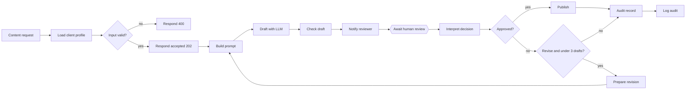

**English** | [简体中文](zh-CN/ARCHITECTURE.md)

# Architecture

## The idea
The model proposes a draft. Deterministic code checks it. A person decides. Nothing reaches `PUBLISH_URL` without an explicit
`approve`, and anything that is not a clear decision is treated as no decision.

## The workflow, node by node
17 nodes in `workflow.json` (generated by `build_workflow.py`).

| # | node | type | what it does |
|---|---|---|---|
| 1 | Content request | Webhook | `POST /webhook/content-request` with `client`, `topic`, optional `facts` |
| 2 | Load client profile | Code | looks up the client's profile, validates the input, builds the run context |
| 3 | Input valid? | IF | routes invalid input to a 400 |
| 4 | Respond 400 | Respond to Webhook | returns `rejected_input` with the errors; no model call is made |
| 5 | Respond accepted | Respond to Webhook | returns 202 with `request_id` right away; the rest runs in the background |
| 6 | Build prompt | Code | builds the system and user prompt; on a revision it adds the reviewer's feedback and the previous draft |
| 7 | Draft with LLM | HTTP Request | `POST $LLM_BASE_URL/chat/completions` (OpenAI-compatible), 120 s timeout |
| 8 | Check draft | Code | runs the deterministic checks on the model's text |
| 9 | Notify reviewer | HTTP Request | `POST $NOTIFY_URL` with the draft, the check results and the one-time `resume_url` |
| 10 | Await human review | Wait | pauses the execution until the resume URL is called (POST), or 24 hours pass |
| 11 | Interpret decision | Code | turns the reply into `approve`, `revise`, `reject` or `expired`; decides whether another revision is allowed |
| 12 | Approved? | IF | approve goes to Publish; everything else goes to Revise? |
| 13 | Publish | HTTP Request | `POST $PUBLISH_URL` with the approved text |
| 14 | Revise? | IF | true only if the decision is `revise` and fewer than 3 drafts have been made |
| 15 | Prepare revision | Code | builds the next run context (attempt + 1, feedback, previous draft) and loops back to Build prompt |
| 16 | Audit record | Code | builds the outcome record |
| 17 | Log audit | HTTP Request | `POST $AUDIT_URL` with the record |

## The run context
Everything the workflow needs travels in one object (`ctx`): `request_id` (the n8n execution id), `client`, `topic`, `facts`,
the client `profile`, `attempt`, `feedback` and `previous_draft`. `Check draft` and `Interpret decision` read it back from
earlier nodes, so a revision restarts the same chain with `attempt + 1` and the reviewer's words added.

## Client profiles
Kept in the Code node `Load client profile`. Each has a `voice`, an `audience`, a `max_chars` limit and a list of `banned` words.
They are fictional examples; the shipped profiles are `board-advisor`, `startup-coach` and `retail-brand`.

## The four checks (`Check draft`)
| check | passes when |
|---|---|
| `not_empty` | the model returned text |
| `length_within_limit` | the draft is no longer than the client's `max_chars` |
| `no_banned_words` | none of the client's banned words appear (case-insensitive substring) |
| `numbers_supported_by_facts` | every number in the draft also appears in the supplied `facts` |

The result is `passed` (all four) plus the per-check list with a `detail` such as `241/700`. Failing checks do not block the
reviewer from approving; they are shown next to the draft, and an approval over failed checks is recorded as
`approved_with_failed_checks`.

## Decisions and outcomes
The reviewer replies `{"decision": "approve" | "revise" | "reject", "feedback": "...", "reviewer": "..."}`.

| reply | result |
|---|---|
| `approve` | published, outcome `published` |
| `revise` with fewer than 3 drafts so far | a new draft that takes the feedback into account |
| `revise` on the third draft | stops, outcome `revision_limit_reached` |
| `reject` | stops, outcome `rejected` |
| anything else, or no reply in 24 hours | stops, outcome `expired_no_decision` |

The audit record holds `request_id`, `client`, `topic`, `attempts`, `outcome`, `reviewer`, `approved_with_failed_checks` and the
final text only if it was published.

## Known gaps
- There is no error handling around the HTTP nodes. If the model call, the reviewer notification or the publish call fails, the
  execution fails; the requester has already received the 202 and is not told.
- The wait is per execution, so many open reviews are many paused executions in n8n.
- Profiles live inside the workflow; changing one means editing the node and re-importing.
