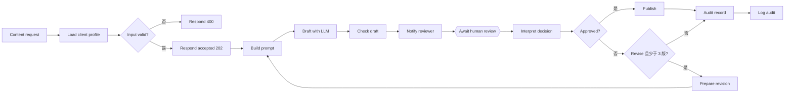

[English](../ARCHITECTURE.md) | **简体中文**

# 架构

## 思路
模型提出草稿,确定性代码检查,由人来决定。没有明确的 `approve`,任何东西都到不了 `PUBLISH_URL`;凡是不是明确决定的回复,都按"没有决定"处理。

## 工作流,逐个节点
`workflow.json` 里有 17 个节点(由 `build_workflow.py` 生成)。

| # | 节点 | 类型 | 作用 |
|---|---|---|---|
| 1 | Content request | Webhook | `POST /webhook/content-request`,带 `client`、`topic`、可选的 `facts` |
| 2 | Load client profile | Code | 查找客户档案、校验输入、构建本次运行的上下文 |
| 3 | Input valid? | IF | 把非法输入导向 400 |
| 4 | Respond 400 | Respond to Webhook | 返回带错误说明的 `rejected_input`;不调用模型 |
| 5 | Respond accepted | Respond to Webhook | 立刻返回 202 和 `request_id`;其余部分在后台继续 |
| 6 | Build prompt | Code | 构建系统提示和用户提示;修改时加入审核人的意见和上一版草稿 |
| 7 | Draft with LLM | HTTP Request | `POST $LLM_BASE_URL/chat/completions`(OpenAI 兼容),超时 120 秒 |
| 8 | Check draft | Code | 对模型的文字运行确定性检查 |
| 9 | Notify reviewer | HTTP Request | `POST $NOTIFY_URL`,带草稿、检查结果和一次性的 `resume_url` |
| 10 | Await human review | Wait | 暂停执行,直到恢复链接被调用(POST),或过了 24 小时 |
| 11 | Interpret decision | Code | 把回复变成 `approve`、`revise`、`reject` 或 `expired`;决定是否还允许再改一次 |
| 12 | Approved? | IF | approve 去 Publish;其余去 Revise? |
| 13 | Publish | HTTP Request | `POST $PUBLISH_URL`,带批准的文字 |
| 14 | Revise? | IF | 仅当决定是 `revise` 且已生成的草稿少于 3 版时为真 |
| 15 | Prepare revision | Code | 构建下一轮的上下文(attempt + 1、意见、上一版草稿),并回到 Build prompt |
| 16 | Audit record | Code | 构建结果记录 |
| 17 | Log audit | HTTP Request | `POST $AUDIT_URL`,带该记录 |

## 运行上下文
工作流需要的一切都放在一个对象(`ctx`)里传递:`request_id`(n8n 的执行 id)、`client`、`topic`、`facts`、客户的 `profile`、`attempt`、`feedback` 和 `previous_draft`。`Check draft` 和 `Interpret decision` 从前面的节点把它读回来,所以一次修改就是用 `attempt + 1` 并加入审核人的话,重新走同一条链。

## 客户档案
保存在 Code 节点 `Load client profile` 里。每个档案有 `voice`(语气)、`audience`(受众)、`max_chars`(长度上限)和 `banned`(禁用词)列表。它们是虚构的示例;自带的档案是 `board-advisor`、`startup-coach` 和 `retail-brand`。

## 四项检查(`Check draft`)
| 检查 | 通过的条件 |
|---|---|
| `not_empty` | 模型返回了文字 |
| `length_within_limit` | 草稿不超过客户的 `max_chars` |
| `no_banned_words` | 客户的禁用词一个都没出现(不区分大小写的子串匹配) |
| `numbers_supported_by_facts` | 草稿里的每个数字也都出现在提供的 `facts` 里 |

结果是 `passed`(四项全过)加上逐项列表,其中 `detail` 形如 `241/700`。检查失败并不会阻止审核人批准;它们显示在草稿旁边,在检查失败的情况下批准会被记录为 `approved_with_failed_checks`。

## 决定与结果
审核人回复 `{"decision": "approve" | "revise" | "reject", "feedback": "...", "reviewer": "..."}`。

| 回复 | 结果 |
|---|---|
| `approve` | 发布,结果 `published` |
| `revise`,且目前草稿少于 3 版 | 生成考虑了意见的新草稿 |
| 在第三版草稿上 `revise` | 停止,结果 `revision_limit_reached` |
| `reject` | 停止,结果 `rejected` |
| 其他任何回复,或 24 小时内没有回复 | 停止,结果 `expired_no_decision` |

审计记录包含 `request_id`、`client`、`topic`、`attempts`、`outcome`、`reviewer`、`approved_with_failed_checks`,只有已发布的才带最终文字。

## 已知缺口
- HTTP 节点周围没有错误处理。如果模型调用、通知审核人或发布调用失败,执行就会失败;请求方已经收到了 202,不会被告知。
- 等待是按执行计的,所以很多未处理的审核就是 n8n 里很多个暂停的执行。
- 档案放在工作流内部;修改一个就要编辑节点并重新导入。
